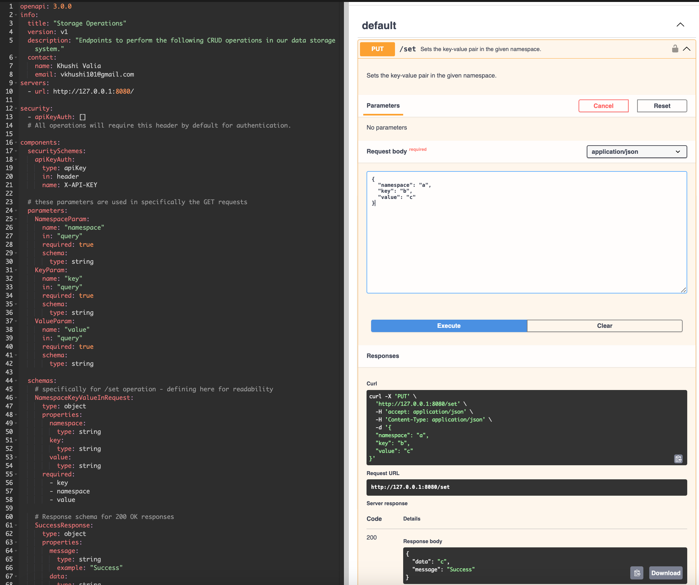

Hello Midstream team! 

The following steps are necessary to spin up the project and hit the endpoints to perform the CRUD operations:


# Docker
Note: Docker steps are not yet fully working as expected. Right now, doesn't seem like the Flyway scripts are fully working with Docker. But don't fret, this fix shouldn't take too long! In the meantime, please run testing on the endpoints with `make run`.


To get the container, networks, volumes, and images up and running
```> make docker-up ```


To kill and clean existing containers, networks, volumes, and images
```> make docker-down ```


To run the app locally and hit endpoints without spinning up docker (preferred route until Docker fixed)
```> make run ```


# Testing
To run all integration tests (including the ones described in the requirements documentation)
```> make test ```


# Database
To run the database setup and migrations without running the application or docker containers
```> make db-migrate```


To drop entries in the database
```> make db-clean```


To visualize the Database, I would suggest using an IDE plugin or tool such as DBeaver to create a MySQL connector using the secrets stored in the project's `.env` file. <br>


# Swagger
After spinning up the application with `make run`, you can direct to `https://editor.swagger.io/` for a friendly UI to hit the endpoints. <br>
In the Swagger webpage, make sure server is set to http://127.0.0.1:8080/ <br>




Please reach out to `vkhushi101@gmail.com` if any questions!